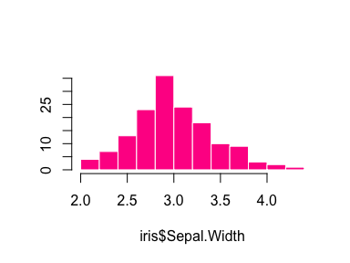

[](https://travis-ci.org/goldingn/default) [](https://codecov.io/github/goldingn/default?branch=master) [](https://cran.rstudio.com/web/packages/default) [](http://cran.rstudio.com/web/packages/default/index.html)

default
=======

### change the default arguments in R functions.

Tired of always typing out the same old arguments to functions? Use `default()` to set your favourite arguments as the defaults.

### Example:

``` r
install.packages("default")
library(default)
```

##### boring old defaults

``` r
hist(iris$Sepal.Width)
```


##### exciting new defaults

``` r
default(hist.default) <- list(col = "deeppink", border = "white", ylab = "", main = "")
```

``` r
hist(iris$Sepal.Width)
```



##### you can still change the arguments

``` r
hist(iris$Sepal.Width, col = "limegreen")
```


##### and restore the original defaults

``` r
hist.default <- reset_default(hist.default)
hist(iris$Sepal.Width)
```


