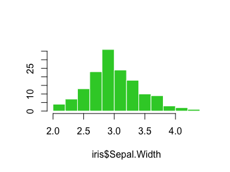

[](https://travis-ci.org/goldingn/defaults) [](https://codecov.io/github/goldingn/defaults?branch=master) [](https://cran.rstudio.com/web/packages/defaults)

defaults
========

### change the default arguments in R functions.

Tired of always typing out the same old arguments to functions? Use `defaults()` to set your favourite arguments as the defaults.

##### boring old defaults

``` r
hist(iris$Sepal.Width)
```


##### exciting new defaults

``` r
library (defaults)
defaults(hist.default) <- list(col = "deeppink", border = "white", ylab = "", main = "")

hist(iris$Sepal.Width)
```


##### you can still change the arguments

``` r
hist(iris$Sepal.Width, col = "limegreen")
```



##### and restore the original defaults

``` r
hist.default <- reset_defaults(hist.default)
hist(iris$Sepal.Width)
```


##### you can install defaults from github

``` r
devtools::install_github("goldingn/defaults")
```
